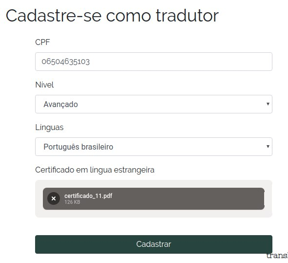
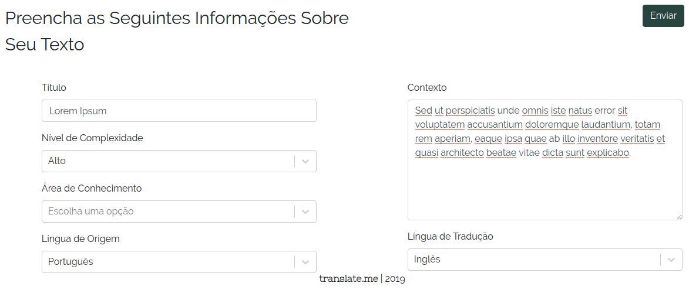
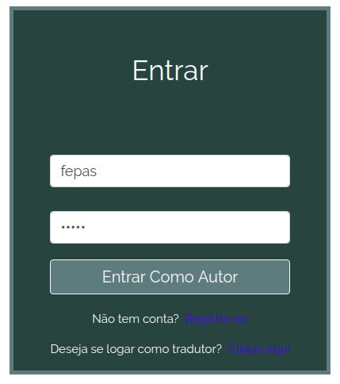

## Teste Funcional

A aplicação do teste funcional tem como objetivo verificar se a aplicação segue os requisitos definidos no desenvolvimento do projeto.

Para o escopo da disciplina, foi decidido que os testes seriam realizados e relação aos requisitos que, ao serem movidos como histórias para o *backlog*, receberam a priorização da categoria "must", ou seja, os requisitos que deveriam ser obrigatóriamente atendidos. Os requisitos e a priorização foram retirados da [Wiki](https://translate-me.github.io/docs/) do projeto.

Os testes realizados são do tipo black-box em que o componente de software a ser testado é abordado como se fosse uma caixa-preta, ou seja, não se considera o comportamento interno do mesmo.

## Tabela de Requisitos
| Requisitos                                                                                                                                           | ID   |
| ---------------------------------------------------------------------------------------------------------------------------------------------------- | ---- |
| A Aplicação deve possuir um sistema de cadastro                                                                                                      | RF01 |
| A aplicação deve permitir a diferenciação entre usuários tradutores e usuários autores                                                               | RF04 |
| O usuário não poderá começar nenhuma tradução sem antes confirmar que está de acordo com as políticas de privacidade e de segurança de dados do site | RF41 |
| A aplicação deve notificar o usuário da não responsabilização por direitos autorais                                                                  | RF12 |
| A Aplicação deve possuir sistema de verificação de proficiência dos falantes da língua                                                               | RF20 |
| A Aplicação deve possuir uma funcionalidade de inserção de texto pelo usuário autor a ser traduzido pelo usuário tradutor                            | RF08 |
| O usuário tradutor deve adicionar informação sobre o texto submetido                                                                                 | RF42 |
| Os fragmentos de texto devem possuir *tags* que indiquem o tema e a complexidade do texto geral                                                      | RF18 |
| O usuário tradutor deve poder trabalhar na tradução de um texto                                                                                      | RF43 |
| A Aplicação deve limitar novas correções por revisões de correções de outros usuários                                                                | RF27 |
| A Aplicação deve possuir um sistema de pontuação para usuários tradutores                                                                            | RF24 |
| O Sistema de pontuação deve ser utilizado para priorizar a disponibilização de fragmentos para tradução                                              | RF26 |
| A Aplicação possuir sistema de revisão por usuários de fragmentos traduzidos                                                                         | RF23 |
| A Aplicação deve possuir um sistema de Login próprio                                                                                                 | RF29 |
| A aplicação deve possuir um sistema de Carteira Virtual para transferência de créditos como pagamento por serviço                                    | RF07 |
| A aplicação deve possuir uma página de acompanhamento de tradução para o usuário autor                                                               | RF16 |
| A aplicação deve possuir um sistema de separação do texto em fragmentos para correção                                                                | RF10 |
| O usuário autor deve pagar pelo serviço de tradução dos usuários tradutores                                                                          | RF45 |
| O site deve conter uma página inicial explicando o que é o site e como ele funciona                                                                  | RF35 |
| O Usuário Tradutor deve poder fazer correções nas traduções em que atua como revisor                                                                 | RF28 |
| A aplicação deve ter um sistema de penalidade para traduções e revisões ruins                                                                        | RF47 |
| O site deve conter uma página para explicar as diretrizes de segurança de direitos autorais                                                          | RF36 |
| A aplicação deve informar ao usuário um prazo para a entrega da correção conforme a quantidade e tamanho dos fragmentos                              | RF14 |

## Aplicação do Teste

- **RF01 - A Aplicação deve possuir um sistema de cadastro**

  O sistema possui o sistema de cadastro.

  

- **RF04 - A aplicação deve permitir a diferenciação entre usuários tradutores e usuários autores**

  A aplicação permite a diferenciação por meio de diferentes ícones para cada tipo de usuário.

  
   
  

- **RF41 - O usuário não poderá começar nenhuma tradução sem antes confirmar que está de acordo com as políticas de privacidade e de segurança de dados do site**

  Não foi encontrada funcionalidade que satisfaça o requisito.

- **RF12 - A aplicação deve notificar o usuário da não responsabilização por direitos autorais**    

  Existe um aviso sobre a responsabilidade sobre os direitos autorais na homepage da aplicação.

  
                                           
- **RF20 - A Aplicação deve possuir sistema de verificação de proficiência dos falantes da língua**

  Existe um campo para adição de  certificados de proficiência em língua estrangeira.

  

- **RF08 - A Aplicação deve possuir uma funcionalidade de inserção de texto pelo usuário autor a ser traduzido pelo usuário tradutor**

  Existe um campo para inserção de texto para tradução.

  

- **RF42 - O usuário tradutor deve adicionar informação sobre o texto submetido**]

  Existe uma tela específica para esse propósito.

  

- **RF18 - Os fragmentos de texto devem possuir *tags* que indiquem o tema e a complexidade do texto geral**

  Existe uma tela específica para esse propósito. A mesma tela que contempla o RF42.

  

- **RF43 - O usuário tradutor deve poder trabalhar na tradução de um texto**

  Não foi encontrada funcionalidade que satisfaça o requisito.

- **RF27 - A Aplicação deve limitar novas correções por revisões de correções de outros usuários**

  Não foi encontrada funcionalidade que satisfaça o requisito.

- **RF24 - A Aplicação deve possuir um sistema de pontuação para usuários tradutores**

  Não foi encontrada funcionalidade que satisfaça o requisito.

- **RF26 - O Sistema de pontuação deve ser utilizado para priorizar a disponibilização de fragmentos para tradução**

  Não foi encontrada funcionalidade que satisfaça o requisito.

- **RF23 - A Aplicação possuir sistema de revisão por usuários de fragmentos traduzidos**

  Não foi encontrada funcionalidade que satisfaça o requisito.

- **RF29 - A Aplicação deve possuir um sistema de Login próprio**

  A aplicação possui sistema de login próprio.

  

- **RF07 - A aplicação deve possuir um sistema de Carteira Virtual para transferência de créditos como pagamento por serviço**

  Existe um ícone que simboliza a carteira do usuário, porém a mesma parece não estar completamente implementada.

  

- **RF16 - A aplicação deve possuir uma página de acompanhamento de tradução para o usuário autor**

  Não foi encontrada funcionalidade que satisfaça o requisito.

- **RF10 - A aplicação deve possuir um sistema de separação do texto em fragmentos para correção**

  Existe um campo onde o usuário pode quebrar o texto em trechos para tradução.

  

- **RF45 - O usuário autor deve pagar pelo serviço de tradução dos usuários tradutores**

  Existe um botão para a realização do pagamento, mas aparenta não estar completamente implementado.

  

- **RF35 - O site deve conter uma página inicial explicando o que é o site e como ele funciona**

  Existe uma sessão específica para o esclarecimento do usuário em relação ao funcionamento do software.

  

- **RF28 - O Usuário Tradutor deve poder fazer correções nas traduções em que atua como revisor**

  Não foi encontrada funcionalidade que satisfaça o requisito.

- **RF47 - A aplicação deve ter um sistema de penalidade para traduções e revisões ruins**
  
  Não foi encontrada funcionalidade que satisfaça o requisito.

- **RF36 - O site deve conter uma página para explicar as diretrizes de segurança de direitos autorais**

  Existe um texto explicativo sobre direitos autorais na homepage. O mesmo contempla o RF12.

  

- **RF14 - A aplicação deve informar ao usuário um prazo para a entrega da correção conforme a quantidade e tamanho dos fragmentos**

  Não foi encontrada funcionalidade que satisfaça o requisito.

  ## Resultado do Teste

    Os resultados mostraram uma falha em um ponto específico da aplicação. Os requisitos que se encontravam, em termos de fluxo, antes do processo de submissão do texto para tradução estão todos de acordo. Porém, os requisitos que estão em partes do fluxo mais avançadas, não puderam ser avaliados.

